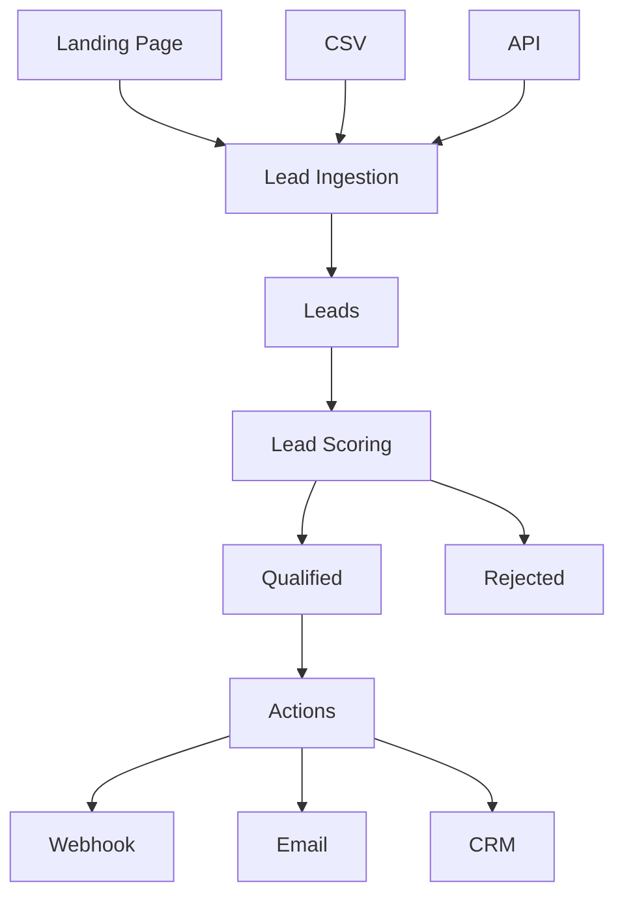

# LeadFlow

Plataforma de prospeccao e qualificacao de leads construída para estudar NestJS em um contexto próximo de um produto de Growth e Business Engineering.

O sistema recebe leads de diferentes fontes, armazena seus dados, calcula uma pontuacao de interesse e, no futuro, executa acoes como notificacoes, webhooks e sincronizacao com CRM.

## Fluxo do produto



## Objetivo

O LeadFlow e um laboratorio incremental de NestJS. A arquitetura cresce somente quando um novo assunto exigir isso, evitando adicionar banco, fila e integracoes antes de haver uma necessidade concreta.

## Entidade principal

```ts
Lead {
  id: string;
  name: string;
  email: string;
  company: string;
  source: string;
  status: LeadStatus;
  score: number;
  createdAt: Date;
}
```

Os campos `id`, `status`, `score` e `createdAt` sao controlados pela aplicacao. Os dados de entrada do usuario sao validados por DTOs.

## Roadmap de estudo

### Fase 1: CRUD de leads

Endpoints iniciais:

```text
POST   /leads
GET    /leads
GET    /leads/:id
PATCH  /leads/:id
DELETE /leads/:id
```

Conceitos: modules, controllers, providers, services, DTOs, validation pipes, dependency injection, configuracao e exception handling.

### Fase 2: Autenticacao

```text
POST /auth/register
POST /auth/login
GET  /me
```

Protecao das rotas de leads com JWT, Passport, guards, decorators e autorizacao.

### Fase 3: Persistencia

PostgreSQL com Prisma:

```text
LeadService -> PrismaService -> PostgreSQL
```

Nest organiza a aplicacao; Prisma e a camada de acesso aos dados.

### Fase 4: Lead scoring

Um provider dedicado calcula a pontuacao do lead:

```text
empresa grande       +30
email corporativo    +20
origem: Google       +10
visitou pricing      +20
baixou material      +10
```

Regras iniciais de classificacao:

```text
score >= 70  QUALIFIED
score >= 40  NURTURE
score < 40   REJECTED
```

### Fase 5: Eventos

A criacao de um lead publica `LeadCreatedEvent`, permitindo que scoring, analytics e notificacoes sejam processados de forma desacoplada.

### Fase 6: Filas

Redis e BullMQ para mover scoring, enriquecimento e notificacoes para processamento assincrono, mantendo a resposta HTTP rapida.

### Fase 7: Integracoes externas

Enriquecimento de dados da empresa via API, com `HttpModule`, timeout, retry, logs e tratamento de falhas.

### Fase 8: Observabilidade

Correlation ID, logs estruturados, metricas e rastreabilidade para entender o ciclo de vida de cada lead.

### Fase 9: Testes

- Unitarios para `LeadScoringService`, `LeadsService` e `EnrichmentService`.
- Integracao entre controller e banco.
- E2E para o fluxo completo de criacao e processamento de leads.

### Fase 10: Documentacao

Swagger com DTOs, respostas, status HTTP e autenticacao documentados.

## Estrutura inicial

```text
src/
  app.module.ts
  main.ts
  leads/
    dto/
    entities/
    leads.controller.ts
    leads.service.ts
    leads.module.ts
```

## Executando localmente

Instale as dependencias:

```bash
bun install
```

Inicie em desenvolvimento:

```bash
bun run start:dev
```

A API fica disponivel em `http://localhost:3000`.

## Testes

```bash
bun run test
bun run test:e2e
bun run test:cov
```
